## Architecture Diagram

To render this diagram (Mermaid syntax), you can:
-   Use the links below to open it in Mermaid Live Editor, or
-   Install the [Markdown Preview Mermaid Support](https://marketplace.visualstudio.com/items?itemName=bierner.markdown-mermaid) extension.

For any issues or feature requests, please visit our [GitHub repository](https://github.com/swark-io/swark) or email us at contact@swark.io.

## Generated Content
**Model**: GPT 4o - [Change Model](vscode://settings/swark.languageModel)  
**Mermaid Live Editor**: [View](https://mermaid.live/view#pako:eNqNVttu3CAQ_RXk5-QH9qFSkm3VqE2T1mlWKs4DsWe9qCxYGKdZRfn3Yhhs8CXtw9ozZw54mBv7mpWqgmyTFbLWrDmQ-20hCWm7J6_mRmloe4iQ2_1ecAkOoqh4wqMnfFOG73nJDFfSs2Ikod5rJttS82bkJlBCvrEuCk9yYmK8aPgXOHnrxd01sUpkB1kVMjnRlTo2SoI0eKqcV_DENMX3Y3JW97kbJlkNejiy9wFR5H8G0dD-EXTeWh9OFN-IfnxplDa5OQnIQUBpTdRjxIEkoMi_0-rZuqUHcgCmxCR2llTbpLWTiAZ4ackDhz_2hOkCDy7k9spGz7KT5Hpsae_vHXTT7DoMydeyNUyIu90FRZFYeZ6He1XXApIsEI8l0b11X2hDXFFFylar5pfNPu0F0ktouGLlAUKinTJJsC-zwAiFlnLSogZjuKynWQhwcIi1hyfFdEUHaaVufxousGS_qpIJV4XUib4il5xIP46MB9Btb8M3op-UPjJjc9jSUUwi6-EhsqjGAfSRQ-QHGNsA7hliKJk4GV62dJDGQvclmxTpPAjbSwzb5bWs4IVuL4kTVug56Gdewk7p36Cx3XcUUeLhlaU3jMuQ-YbaX8qzADk__xCmRwwtjI7Y3A-JRPcTIoYWxkRsnk6F2LY4CFYJvsNj87zNVxe7Ho6tYyOvhMN36_yk2KOxITRqjMU9GuNJa666Gxov-UroOZ_U-IJz9rHRevP8zvKb-Fp8h5FuM95mkfdOX7DOrlTv_rBkjTTzJtRCqKChMOY5ncfuHd6ig_-z57_ILtv-IGP8ll2b2KOV-W4hAQgiLTvLjmAnGa_sv6DXIjMHOEKRbUiRVbBnnTBF9mZJXVMxA1vO7Hw4ZhujOzjLWGdUfpJl0LXq6kO22TPRwttfxo1KBw) | [Edit](https://mermaid.live/edit#pako:eNqNVttu3CAQ_RXk5-QH9qFSkm3VqE2T1mlWKs4DsWe9qCxYGKdZRfn3Yhhs8CXtw9ozZw54mBv7mpWqgmyTFbLWrDmQ-20hCWm7J6_mRmloe4iQ2_1ecAkOoqh4wqMnfFOG73nJDFfSs2Ikod5rJttS82bkJlBCvrEuCk9yYmK8aPgXOHnrxd01sUpkB1kVMjnRlTo2SoI0eKqcV_DENMX3Y3JW97kbJlkNejiy9wFR5H8G0dD-EXTeWh9OFN-IfnxplDa5OQnIQUBpTdRjxIEkoMi_0-rZuqUHcgCmxCR2llTbpLWTiAZ4ackDhz_2hOkCDy7k9spGz7KT5Hpsae_vHXTT7DoMydeyNUyIu90FRZFYeZ6He1XXApIsEI8l0b11X2hDXFFFylar5pfNPu0F0ktouGLlAUKinTJJsC-zwAiFlnLSogZjuKynWQhwcIi1hyfFdEUHaaVufxousGS_qpIJV4XUib4il5xIP46MB9Btb8M3op-UPjJjc9jSUUwi6-EhsqjGAfSRQ-QHGNsA7hliKJk4GV62dJDGQvclmxTpPAjbSwzb5bWs4IVuL4kTVug56Gdewk7p36Cx3XcUUeLhlaU3jMuQ-YbaX8qzADk__xCmRwwtjI7Y3A-JRPcTIoYWxkRsnk6F2LY4CFYJvsNj87zNVxe7Ho6tYyOvhMN36_yk2KOxITRqjMU9GuNJa666Gxov-UroOZ_U-IJz9rHRevP8zvKb-Fp8h5FuM95mkfdOX7DOrlTv_rBkjTTzJtRCqKChMOY5ncfuHd6ig_-z57_ILtv-IGP8ll2b2KOV-W4hAQgiLTvLjmAnGa_sv6DXIjMHOEKRbUiRVbBnnTBF9mZJXVMxA1vO7Hw4ZhujOzjLWGdUfpJl0LXq6kO22TPRwttfxo1KBw)

```mermaid
graph TD
  subgraph Stores
    OfflineStore[Offline Store]
    NotificationStore[Notification Store]
    TranscriptionStore[Transcription Store]
    ModelStore[Model Store]
    ApiKeyStore[API Key Store]
  end

  subgraph Components
    Sidebar[Sidebar]
    OfflineModelManager[Offline Model Manager]
    Help[Help]
    History[History]
    ExportStyleSelector[Export Style Selector]
    ProviderSelector[Provider Selector]
    TranscriptionProgress[Transcription Progress]
    TranscriptionViewer[Transcription Viewer]
    NotificationCenter[Notification Center]
    TranscriptionQueue[Transcription Queue]
    InstallPWA[Install PWA]
    OfflineModeToggle[Offline Mode Toggle]
    ExportOptions[Export Options]
    DropZone[Drop Zone]
    CacheManager[Cache Manager]
    ApiKeyManager[API Key Manager]
    TranscriptionSettings[Transcription Settings]
    Dashboard[Dashboard]
  end

  subgraph Utils
    LocalModel[Local Model]
    Transcription[Transcription]
    Version[Version]
    Formatters[Formatters]
    ExportFormats[Export Formats]
    Cache[Cache]
    Retry[Retry]
    Analytics[Analytics]
    Progress[Progress]
  end

  subgraph DB
    DBIndex[DB Index]
  end

  subgraph ServiceWorker
    SW[Service Worker]
  end

  subgraph Main
    App[App]
  end

  App --> Sidebar
  App --> OfflineModelManager
  App --> Help
  App --> History
  App --> ExportStyleSelector
  App --> ProviderSelector
  App --> TranscriptionProgress
  App --> TranscriptionViewer
  App --> NotificationCenter
  App --> TranscriptionQueue
  App --> InstallPWA
  App --> OfflineModeToggle
  App --> ExportOptions
  App --> DropZone
  App --> CacheManager
  App --> ApiKeyManager
  App --> TranscriptionSettings
  App --> Dashboard

  OfflineStore --> LocalModel
  TranscriptionStore --> DBIndex
  TranscriptionStore --> LocalModel
  ModelStore --> ApiKeyStore
  ModelStore --> NotificationStore
  ApiKeyStore --> NotificationStore

  TranscriptionProgress --> Progress
  TranscriptionQueue --> Transcription
  TranscriptionQueue --> NotificationStore
  TranscriptionQueue --> TranscriptionStore
  TranscriptionQueue --> Cache

  LocalModel --> Transcription
  LocalModel --> Cache

  SW --> LocalModel
  SW --> Cache
```

